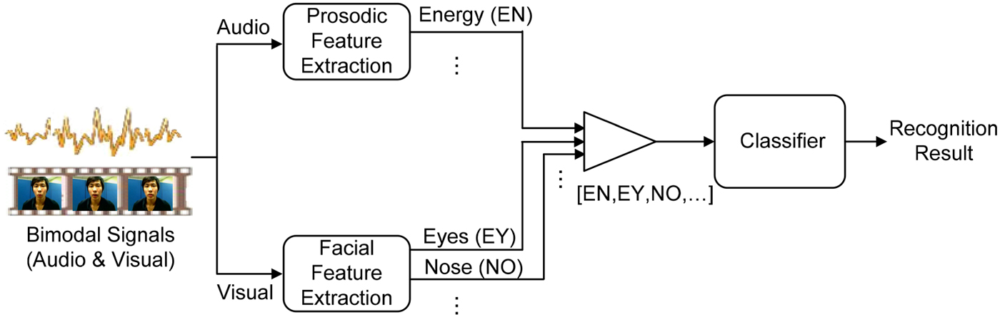
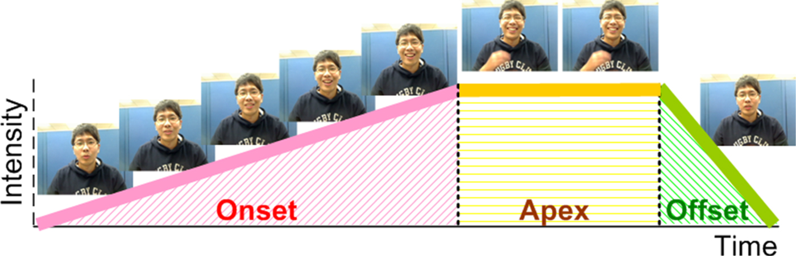

### Survey on audiovisual emotion recognition 

#### Abstract

In this paper, a survey on the theoretical and practical work offering new and broad views of the latest research in emotion recognition from bimodal information including facial and vocal expressions is provided. First, the currently available audiovisual emotion databases are described. Facial and vocal features and audiovisual bimodal data fusion methods for emotion recognition are then surveyed and discussed. Specifically, this survey also covers the recent emotion challenges in several conferences. Conclusions outline and address some of the existing emotion recognition issues.

#### Introduction

This paper gives a survey on the existing audiovisual emotion databases and recent advances in the research on audiovisual bimodal data fusion strategies.

#### AudioVisual emotion databases

Audiovisual databases for emotion recognition task

1. Elicitation method
   1. posed (acted)
   2. induced (via clips)
   3. spontaneous (occurring during an interaction)
2. Emotion categorization
   1. discrete categorical representation
   2. continuous dimensional representation
   3. event representation (affective behavior; e.g. level of interest, depression, laughter, etc.) 

#### AudioVisual bimodal fusion for emotion recognition

Literature review on facial–vocal expression-based emotion recognition.

1. Audio features

   Correlations among prosodic features and emotions

   

   1. local (frame-level) features

      The local features represent the speech features extracted based on the unit of speech “frame”.

      spectral LLDs (e.g. MFCCs and Mel Filter Bank (MFB)), energy LLDs (e.g. loudness, energy), and voice LLDs (e.g. F0, jitter and shimmer)

   2. global (utterance-level) features

      The global features are calculated from the statistics of all speech features extracted from the entire “utterance” 

      The set of functionals extracted from the LLDs, such as max, min, mean, standard deviation, duration, linear predictive coefficients (LPC)

   3. Traditional pattern recognition engines such as Hidden Markov Model (HMM), Gaussian Mixture Model (GMM), support vector machine (SVM), etc. have been used in speech emotion recognition systems to decide the underlying emotion of the speech utterance. features.

2. Facial Features

   1. Appearance

       Depict the facial texture such as wrinkles, bulges, and furrows

   2. Geometric

      Represent the shape or location of facial components 

   3. Model

      1. Active appearance model 

         The AAM achieved successful human face alignment, even for the human faces having non-rigid deformations.

      2. Local binary patterns 

         Being the dense local appearance descriptors, local binary patterns (LBPs) have been used extensively for facial expression recognition in recent years

      3. The linear interpolation technique

         For audiovisual data fusion, to deal with the problem of mismatched frame rates between audio and visual features, the linear interpolation technique has been widely applied, which interpolates the video features to match the frame rate of audio features

3. Bimodal fusion approaches

   1. Feature-level (early) fusion

      Facial and vocal features are concatenated to construct a joint feature vector, and are then modeled by a single classifier for emotion recognition

      Illustration of feature-level fusion strategy for audiovisual emotion recognition.

      

   2. The decision-level fusion

      Multiple signals can be modeled by the corresponding classifier first, and then the recognition results from each classifier are fused in the end, as shown in Fig. 5. The fusion-based method at the decision level, without increasing the dimensionality, can combine various modalities by exploring the contributions of different emotional expressions. 

       Illustration of decision-level fusion strategy for audiovisual emotion recognition.

      

   3. A model-level fusion strategy

      Be proposed to emphasize the correlation information between multimodalities and explore the temporal relationship between audio and video signal streams (as shown in Figure 6).

      

      There are several distinctive examples such as Coupled HMM (C-HMM), Tripled HMM (T-HMM), Multistream Fused HMM (MFHMM), and Semi-Coupled HMM (SC-HMM)

   4. Hybrid approach

      Be proposed to integrate different fusion approaches to obtain a better emotion recognition result.

      The Error Weighted SC-HMM (EWSC-HMM), as an example of the hybrid approach, consists of model-level and decision-level fusion strategies and concurrently combines both advantages. 

4. A few related issues

   1. Another important issue in audiovisual data fusion is related to the problem of asynchrony between audiovisual signals. For audiovisual data fusion, current feature-level fusion methods deal with asynchrony based on strict constraints on temporal synchronization between modalities or using static features from each input utterance (i.e., ignoring temporal information). Therefore, under the assumption of strict temporal synchronization, feature-level fusion does not work well if the input features of human voices and facial expressions differ in temporal features. Furthermore, since decision-level fusion methods focus on exploring how to effectively combine recognition outputs from separate audio and video classifiers that independently model audio and video signal flows, synchronization can be ignored in decision-level fusion problem. On the one hand, model-level fusion methods (such as C-HMM, T-HMM, SC-HMM, T_AsyDBN, etc.) Recently proposed and applied to audiovisual emotion recognition, it attempts to model asynchronous voice and facial expressions and maintain their natural correlation over time. Unlike the dynamic programming algorithms (Viterbi and forward analysis) used in traditional HMMs to deal with temporal changes, current model-level fusion methods Extended to handle synchronization issues by desynchronizing audio and video streams and aligning audiovisual signals at the state level. Therefore, current model-level fusion methods such as C-HMM can achieve good performance for audiovisual signals with large synchronization deviations.

   2. Furthermore, for naturalistic emotion recognition, several existing fusion strategies explore the evolutionary patterns of emotion expression in dialogue environments. These methods take into account intra-sentence/inter-sentence emotional sub-states or emotional state transitions in a dialogue, not only exploiting the correlation between audio and video streams, but also exploring the evolution patterns of emotional sub-states or emotional states. Previous studies have shown that a complete emotional expression can be divided into three consecutive temporal phases, onset (application), apex (release), and offset (relaxation), which take into account the mode and intensity of the expression.

      An example of the temporal phases of onset, apex, and offset of facial expression is shown in [Fig. 7](https://proxy.library.spbu.ru:2158/core/journals/apsipa-transactions-on-signal-and-information-processing/article/survey-on-audiovisual-emotion-recognition-databases-features-and-data-fusion-strategies/5BA206CFFEC3BAE321842B8EB820E179#fig07).

      

      [Figure 8](https://proxy.library.spbu.ru:2158/core/journals/apsipa-transactions-on-signal-and-information-processing/article/survey-on-audiovisual-emotion-recognition-databases-features-and-data-fusion-strategies/5BA206CFFEC3BAE321842B8EB820E179#fig08) illustrates model- and state-level alignments between audio and visual HMM sequences in the happy emotional state. 

      

5. Conclusion

   This paper provides a survey on the latest research and challenges focusing on the theoretical background, databases, features, and data fusion strategies in audiovisual emotion recognition. First, the importance of integrating the facial and vocal cues is introduced. Second, we list the audiovisual emotion databases between 2006 and 2014 which were commonly used in audiovisual emotion recognition studies and emotion challenges from facial and vocal expressions. The content of the elicitation method and emotion categorization of the audiovisual emotion databases are also described. Third, the studies of data fusion strategies for facial–vocal expression-based emotion recognition in recent years are summarized, where the content of audio features, facial features, audiovisual bimodal fusion approach, and a few related issues are explained. Although a number of promising studies have been proposed and successfully applied to various applications, there are still some important issues, outlined in the following, needed to be addressed.