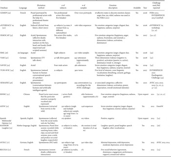
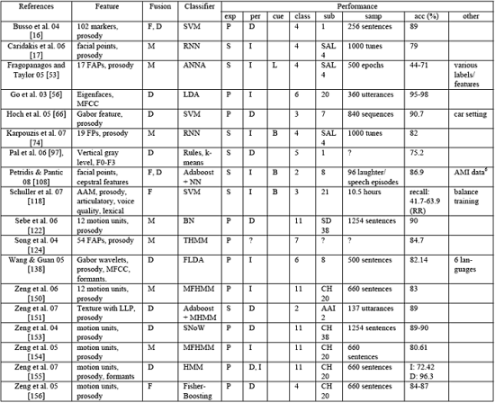

|      | Paper title| Dataset| Preprocessing| Algorithm|Experiment Results|
| :--- |-- | ---------------------------- | -- |-- | ---------------- |
| 1    | Deep Audio-visual  Speech Recognition                        | 1.LRS2     2.LRS3| 1.Generate  the dataset     2.Method of divide the dataset   | 1.Training  Strategy : Curriculum learning     2.Seq2seq         3.CTC | 1.Lip  only (Seq2seq better than CTC)  2.Out-of-sync Audio and Video (Seq2seq is better) 3. Seq2seq vs CTC 3.1Training time (CTC faster than  seq2seq) 3.2Inference time (CTC faster  than seq2seq) |
| 2    | Audio-Visual  Speech Recognition with a Hybrid      CTC/Attention Architecture(2018) | LRS2| Extract the mouth ROI from the LRS2 dataset| 1.ResNet2.(B)LSTMs3.CTC4.RNN-LM | Audio-visual  model(early fusion) is beteer than audio-only model |
| 3    | Vggsound: A  lager-scale Audio-Visual Dataset| Vggsound|| 1.Vggish  model 2.ResNet 3.NetVLAD | Propose  an automated pipeline for collecting a large-scale audio-visual dataset – VGGSound. |
| 4    | Learning affective features with  a hybrid deep model for      audio–visual emotion recognition | The acted RML database theacted eNTERFACE05 database the spontaneous BAUM-1s database | 1) Audio Input Generation 2) Visual Input Generation: | 1.CNN 2.3D-CNN 3.DBN | hybrid deep learning model jointly learns a discriminative audio-visual feature representation, which performs better than previous hand-crafted     features and fusion methods on emotion recognition tasks. |
| 5    | A combined rule-based &  machine learning audio-visual emotion recognition approach | | face detection and localization Voice Activity Detector (VAD) | 1.PCA 2.LDA 3.BDPCA 4.LSLDA | |
| 6    | Emotion recognition using deep  learning approach from audio–visual emotional big data | The 2015 Emotion recognition sub-challenge    dataset of static  facial expression | CNN | 1.CNN 2.ELM                  | |
| 7    | [A novel feature set for video emotion recognition](https://proxy.library.spbu.ru:2068/science/article/pii/S092523121830198X) | 1.VACAD   2.LIRIS-ACCEDE | HHT and the cross-correlation technique    | HHT | VACAD: The RMSE of SVR based on the proposed HHTC features is lower than the one based on the traditional features for all six emotions. Thus, the proposed features can outperform previous approaches with statistical significance.LIRIS-ACCEDE: Thus, the computational load will be reduced by more than 70 times compared with the traditional feature extraction processes. |
| 8    | [Emotion Recognition Using Fusion of Audio and Video Features](https://proxy.library.spbu.ru:2281/abstract/document/8914655) | 1.RECOLA  2.FER | CNN | CNN  | |
| 9    | [Video facial emotion recognition based on local enhanced motion history image and CNN-CTSLSTM networks](https://proxy.library.spbu.ru:2068/science/article/pii/S104732031830364X) | 1.MMI 2.CK+ 3.AFEW | (1) Face detect.(2) Face align.  (3) input normalization | Integrated framework of LEMHI-CNN and CNN-RNN | Proposed framework achieves 93.9%, 78.4%, 51.2% accuracy on CK+, MMI, AFEW respectively. |
| 10   | [Ubiquitous Emotion Recognition Using Audio and Video Data](https://proxy.library.spbu.ru:2356/doi/abs/10.1145/3267305.3267689) | BP4D+                                                        | Video:Use Haar features to detect the face and scale it 256x256 Audio:plot the raw audio signal onto the 2D image plane and scale it 256x256 | CNN convolutional neural networks Inception V3 CNN with 3 convolutional layers of size 32 64 and 128 | presented a method for recognizing emotion using audio and video data, including a method for representing raw audio signals as a plotted waveform.First, is to use the raw audio signals by splitting them into blocks of time and using this raw data to train our deep networks. Second, is the fusion of the modalities. This can be done by creating a new image from the face and audio images. This approach to image fusion has shown success in face recognition. |
| 11   | [Multiple Spatio-temporal Feature Learning for Video-based Emotion Recognition in the Wild](https://proxy.library.spbu.ru:2356/doi/abs/10.1145/3242969.3264992) |                                                              | BLSTM           CNN                                          | multiple spatio-temporal feature fusion (MSFF) framework               3-Dimensional Convolutional Neural Networks (3D CNN) | Extensive experiments show that the overall accuracy of our proposed MSFF is 60.64% |
| 12   | [Survey on audiovisual emotion recognition](https://proxy.library.spbu.ru:2158/core/journals/apsipa-transactions-on-signal-and-information-processing/article/survey-on-audiovisual-emotion-recognition-databases-features-and-data-fusion-strategies/5BA206CFFEC3BAE321842B8EB820E179) |  |                                                              |  | This paper provides a survey on the latest research and challenges focusing on the theoretical background, databases, features, and data fusion strategies in audiovisual emotion recognition. |
| 13   | [A Survey of Affect Recognition Methods](https://proxy.library.spbu.ru:2281/abstract/document/4468714) |  |                                                              |  | This paper focused on surveying and discussing these novel approaches to the machine analysis of human affect and on summarizing the issues that have not received sufficient attention but are crucial for advancing the machine interpretation of human behavior in naturalistic contexts. |
| 14   | [3D Convolutional Neural Networks for Cross Audio-Visual Matching Recognition](https://ieeexplore.ieee.org/document/8063416) | Lip Reading in the Wild (LRW) and the WVU Audio-Visual Dataset dataset (AVD) |  | 3D CNN | Have presented a novel coupled 3D convolutional architecture for audio-visual stream networks with convolutional fusion in temporal dimension and coupling between thenetworks. |
| 15   | [From Audio to Semantics: Approaches to end-to-end spoken language understanding](https://arxiv.org/abs/1809.09190) | Training data consists of 24M anonymized English utterances transcribed by humans. Test set consists of 16K hand transcribed utterances. |  | encoder-decoder framework |  1.having an intermediate text representation is crucial for the quality of the predicted semantics,especially the intent arguments and 2. jointly optimizing the fullsystem improves overall accuracy of prediction.|
| 16  | Co-compressing and Unifying Deep CNN Models for Efficient Human Face and Speaker Recognition | VGGFace2 dataset and LFW dataset |  | CNN/CNN-20 architecture/FR and SR deep-CNN models. | Experiments show the promising results of unified and co-compressing heterogeneous models for efficient inference.|
